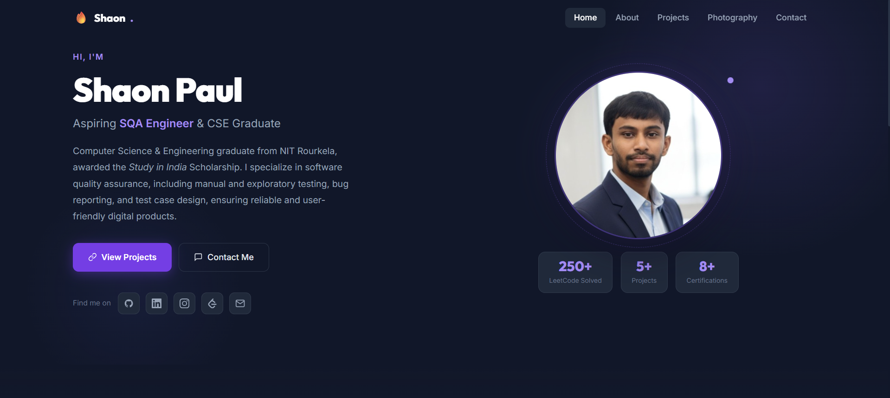
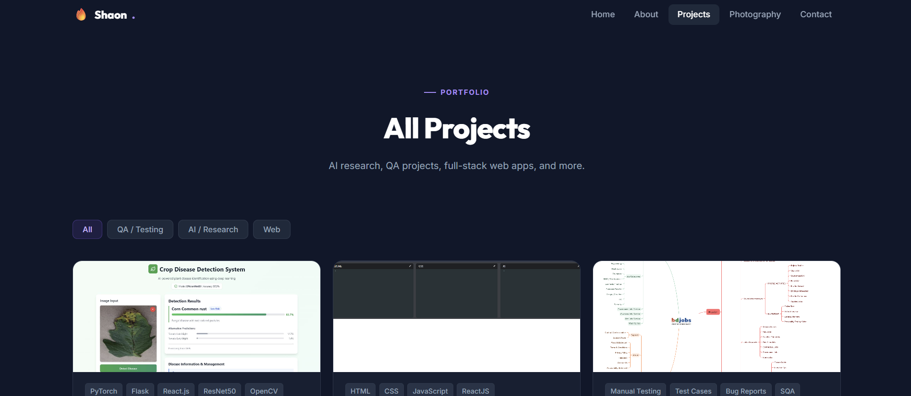
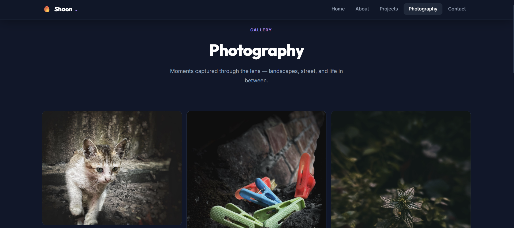

# 🔥 Shaon Paul — Personal Portfolio

> A modern, dark-themed personal portfolio website showcasing my work as an aspiring SQA Engineer, CSE Graduate, AI researcher, and Photographer.

🌐 **Live Site:** [[https://shaon-cse.github.io/Portfolio/](https://shaon-cse.github.io/Portfolio/)]  
📁 **GitHub:** [github.com/shaon-cse](https://github.com/shaon-cse)

---

## ✨ Features

- **Multi-page SPA** — Home, About, Projects, Photography, and Contact pages with smooth transitions, all in a single HTML file
- **Project showcase** — Filterable project cards by category (QA / Testing, AI / Research, Web)
- **Photography gallery** — Masonry-style photo grid with a fullscreen lightbox viewer
- **Animated scroll reveal** — Elements fade in as you scroll using IntersectionObserver
- **Responsive design** — Fully mobile-friendly with a hamburger nav menu
- **Contact form** — Working message form with success state
- **Tech stack chips** — Visual display of all skills and tools
- **Dark theme** — Sleek dark UI with violet accent colors

---

## 📸 Preview

> *(Add screenshots here)*

| Home | About | Photography |
|------|----------|-------------|
|  |  |  |

---

## 🛠️ Tech Stack

| Technology | Usage |
|---|---|
| **HTML5** | Structure & semantic markup |
| **CSS3** | Styling, animations, CSS variables, Grid & Flexbox |
| **Vanilla JavaScript** | DOM manipulation, routing, rendering |
| **Google Fonts** | Inter & Outfit typefaces |
| **IntersectionObserver API** | Scroll-reveal animations |


---

## 📁 Project Structure

```
portfolio/
├── index.html       # All pages (SPA structure)
├── style.css        # All styles
├── script.js        # Navigation, rendering, lightbox, reveal
├── data.js          # All content data & image paths
└── assets/
    ├── shaon.jpg
    ├── P1.jpeg – P6.jpeg
    └── crop.jpg
```

---

<p align="center">Designed & built by <a href="https://github.com/shaon-cse">Shaon Paul</a></p>